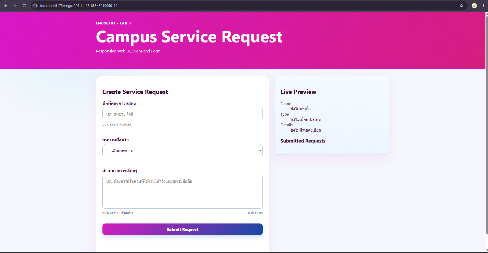
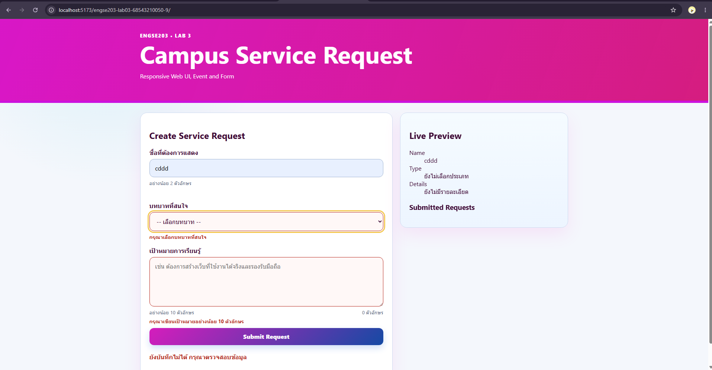
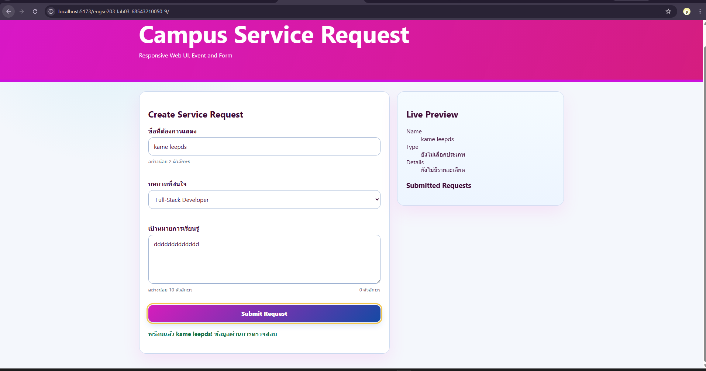

# ENGSE203 LAB 03 — Responsive Web UI & Form Interaction

- ชื่อ-นามสกุล: ฐาปกรณ์ ใจงาม
- รหัสนักศึกษา: 68543210050-9
- ระบบปฏิบัติการที่ใช้: Linux

## วัตถุประสงค์ของงาน
สร้างหน้าเว็บ responsive สำหรับระบบจัดการงานขนาดย่อม ฝึก semantic HTML, CSS layout, mobile-first design, event และ form validation.

## เครื่องมือที่ใช้

Vs code

## วิธีติดตั้งและรัน

npm install
npm run start
npm run build
npm run dev

## โครงสร้างไฟล์

.
├── docs/
├── node_modules/
├── src/
│   ├── main.js
│   └── style.css
├── .gitignore
├── index.html
├── package-lock.json
├── package.json
├── README.md
└── vite.config.js

## หลักฐานผลลัพธ์

## References & AI Assistance

- Source / Documentation:
-----------------------------------------------------
import './style.css';

const form = document.querySelector('#request-form');

// TODO 1: query preview/status/list elements
const status = document.querySelector('#form-status');
const list = document.querySelector('#request-list');

const preview = {
displayName: document.querySelector('#preview-name'),
learningRole: document.querySelector('#preview-role'),
learningGoal: document.querySelector('#preview-goal'),
};

// TODO 2: readForm()
function readForm() {
return Object.fromEntries(new FormData(form).entries());

}
// TODO 3: renderPreview(data)
function renderPreview(data) {

preview.displayName.textContent =
data.displayName.trim() || 'ยังไม่ระบุชื่อ';

preview.learningRole.textContent =
data.learningRole || 'ยังไม่เลือกบทบาท';

preview.learningGoal.textContent =
data.learningGoal.trim() || 'ยังไม่มีเป้าหมายการเรียนรู้';

goalCount.textContent = `${data.learningGoal.length} ตัวอักษร`;

}

// TODO 4: validate(data)
function validate(data) {
const errors = {};

if (data.displayName.trim().length < 2) {
errors.displayName = 'กรุณากรอกชื่ออย่างน้อย 2 ตัวอักษร';

}

if (!data.learningRole) {
errors.learningRole = 'กรุณาเลือกบทบาทที่สนใจ';

}

if (data.learningGoal.trim().length < 10) {
errors.learningGoal = 'กรุณาเขียนเป้าหมายอย่างน้อย 10 ตัวอักษร';

}

return errors;

}
// TODO 5: renderErrors(errors)
function renderErrors(errors) {
for (const name of [
'displayName',
'learningRole',
'learningGoal',
]) {

const field = form.elements[name];

const output = document.querySelector(`#${name}-error`);

const message = errors[name] ?? '';
output.textContent = message;
field.setAttribute('aria-invalid', String(Boolean(message)));

}

}

function renderStatus(state, message) {
status.dataset.state = state;
status.textContent = message;

}

// TODO 6: input and submit listeners
form.addEventListener('input', () => {
const data = readForm();
renderPreview(data);
});

form.addEventListener('submit', (event) => {
    event.preventDefault();
    

    const data = readForm();
    const errors = validate(data);
    renderErrors(errors);

    if (Object.keys(errors).length > 0) {
        renderStatus('invalid', 'ยังบันทึกไม่ได้ กรุณาตรวจสอบข้อมูล');
        form.querySelector('[aria-invalid="true"]')?.focus();
        return;
    }

    renderStatus('success', `พร้อมแล้ว ${data.displayName}! ข้อมูลผ่านการตรวจสอบ`);

});
console.log('LAB 3 starter ready', form);

-----------------------------------------------------

*, *::before, *::after { box-sizing: border-box; }

:root {
  --navy: #eb02b1;
  --blue: #d51dbc;
  --cyan: #cc11dd;
  --yellow: #f3c64d;
  --text: #3f0b36;
  --muted: #5b6b85;
  --surface: #ffffff;
  --surface-alt: #eff7ff;
  --background: #f4f7fc;
  --border: #cbd9ef;
  --danger: #b42318;
  --success: #157347;
  --shadow: 0 18px 45px rgba(255, 91, 214, 0.12);
  --radius: 1.15rem;
}

html { color-scheme: light; }
body {
  margin: 0;
  min-height: 100vh;
  font-family: system-ui, -apple-system, BlinkMacSystemFont, "Segoe UI", sans-serif;
  color: var(--text);
  background:
    radial-gradient(circle at 15% 0%, rgb(22 184 212 / .12), transparent 28rem),
    var(--background);
}

button, input, select, textarea { font: inherit; }
.container { width: min(100% - 2rem, 72rem); margin-inline: auto; }
.hero {
  color: white;
  background:
    linear-gradient(110deg, rgba(216, 24, 200, 0.96), rgba(213, 29, 121, 0.9)),
    linear-gradient(45deg, var(--navy), var(--blue));
  padding: 2.25rem 0 2.5rem;
  border-bottom: 6px solid var(--cyan);
}
.hero__content { max-width: 54rem; }
.eyebrow, .step-label {
  margin: 0 0 .45rem;
  font-size: .8rem;
  font-weight: 850;
  letter-spacing: .12em;
  text-transform: uppercase;
}
.hero h1 { margin: 0; font-size: clamp(2.15rem, 7vw, 4rem); line-height: 1.05; }
.hero__lead { margin: .85rem 0 0; max-width: 50rem; font-size: clamp(1rem, 2.4vw, 1.25rem); color: #e9f4ff; }

.page-grid { display: grid; grid-template-columns: 1fr; gap: 1rem; padding-block: 1.25rem 2.5rem; }
.panel { background: var(--surface); border: 1px solid var(--border); border-radius: var(--radius); padding: 1.2rem; box-shadow: var(--shadow); }
.section-heading h2 { margin: 0; font-size: clamp(1.4rem, 4vw, 1.9rem); }
.section-heading > p:last-child { margin: .4rem 0 1.15rem; color: var(--muted); }
.step-label { color: var(--blue); }

.field { display: grid; gap: .45rem; margin-bottom: 1rem; }
.field label { font-weight: 750; }
input, select, textarea {
  width: 100%;
  border: 1px solid #9eb2d2;
  border-radius: .75rem;
  background: white;
  color: var(--text);
  padding: .8rem .9rem;
}
textarea { resize: vertical; min-height: 8rem; }
input:hover, select:hover, textarea:hover { border-color: var(--blue); }
input:focus-visible, select:focus-visible, textarea:focus-visible, button:focus-visible {
  outline: 3px solid var(--yellow);
  outline-offset: 2px;
}
input[aria-invalid="true"], select[aria-invalid="true"], textarea[aria-invalid="true"] { border-color: var(--danger); background: #fff8f7; }
.hint, .counter { color: var(--muted); }
.error { min-height: 1.2rem; color: var(--danger); font-weight: 650; }
.field-meta { display: flex; justify-content: space-between; gap: 1rem; }

.actions { display: flex; flex-wrap: wrap; gap: .75rem; }
button {
  border: 0;
  border-radius: .75rem;
  padding: .78rem 1.05rem;
  font-weight: 800;
  color: white;
  background: linear-gradient(135deg, var(--blue), #164aa4);
  cursor: pointer;
  box-shadow: 0 8px 18px rgb(29 99 213 / .2);
}
button:hover { transform: translateY(-1px); }
.button-secondary { color: var(--navy); background: #e8eff9; box-shadow: none; }
.status { min-height: 1.5rem; margin: .9rem 0 0; font-weight: 750; }
.status[data-state="invalid"] { color: var(--danger); }
.status[data-state="success"] { color: var(--success); }
.status[data-state="idle"] { color: var(--muted); }

.preview-panel { background: linear-gradient(180deg, #f5fbff, #edf5ff); }
.profile-card {
  display: grid;
  gap: .55rem;
  min-height: 18rem;
  padding: 1.25rem;
  border-radius: 1rem;
  color: white;
  background:
    radial-gradient(circle at 85% 15%, rgb(22 184 212 / .75), transparent 8rem),
    linear-gradient(145deg, var(--navy), var(--blue));
  box-shadow: 0 16px 35px rgb(9 38 93 / .25);
}
.avatar { display: grid; place-items: center; width: 4rem; aspect-ratio: 1; border-radius: 1rem; font-size: 1.4rem; font-weight: 900; color: var(--navy); background: linear-gradient(135deg, white, #cceeff); }
.profile-card__label { margin: .15rem 0 0; font-size: .75rem; font-weight: 850; letter-spacing: .12em; color: #cdefff; }
.profile-card h3 { margin: 0; font-size: clamp(1.55rem, 5vw, 2.2rem); }
.profile-card .role { margin: 0; font-weight: 800; color: #bdefff; }
.profile-card .goal { margin: .25rem 0 0; line-height: 1.65; overflow-wrap: anywhere; }
.concept-box { margin-top: 1rem; padding: 1rem; border: 1px dashed #78a9e8; border-radius: .9rem; background: white; }
.concept-box ol { margin: .6rem 0 0; padding-left: 1.35rem; }
.concept-box code, .section-heading code { padding: .1rem .35rem; border-radius: .35rem; background: #e5efff; color: var(--navy); }
footer { padding: 1.2rem 0 2rem; color: var(--muted); text-align: center; }

@media (min-width: 48rem) {
  .page-grid { grid-template-columns: minmax(0, 1.5fr) minmax(20rem, 1fr); align-items: start; gap: 1.25rem; padding-top: 1.6rem; }
  .panel { padding: 1.5rem; }
  .preview-panel { position: sticky; top: 1rem; }
}

<!doctype html>
<html lang="th">
<head>
  <meta charset="UTF-8" />
  <meta name="viewport" content="width=device-width, initial-scale=1.0" />
  <title>ENGSE203 LAB 3</title>
  
</head>
<body>
  <header class="hero">
    

      
ENGSE203 • LAB 3

      <h1>Campus Service Request</h1>
      
Responsive Web UI, Event and Form

    

  </header>

  <main class="container page-grid">
    <section class="panel" aria-labelledby="form-title">
      <h2 id="form-title">Create Service Request</h2>
      <form id="request-form" novalidate>
        <!-- TODO 1: Requester Name field -->
         

          <label for="display-name">ชื่อที่ต้องการแสดง</label>
          <input
            id="display-name"
            name="displayName"
            type="text"
            minlength="2"
            placeholder="เช่น สมชาย ใจดี"
            aria-describedby="displayName-hint displayName-error"
            required />
          <small id="displayName-hint" class="hint">อย่างน้อย 2 ตัวอักษร</small>
          <small id="displayName-error" class="error"></small>
        

        <!-- TODO 2: Request Type select -->
         

          <label for="learning-role">บทบาทที่สนใจ</label>
          <select id="learning-role" name="learningRole" aria-describedby="learningRole-error" required>
            <option value="">-- เลือกบทบาท --</option>
            <option value="Frontend Developer">Frontend Developer</option>
            <option value="Backend Developer">Backend Developer</option>
            <option value="Full-Stack Developer">Full-Stack Developer</option>
            <option value="UX/UI Designer">UX/UI Designer</option>
          </select>
          <small id="learningRole-error" class="error"></small>
        

        <!-- TODO 3: Details textarea -->
            

          <label for="learning-goal">เป้าหมายการเรียนรู้</label>
          <textarea
            id="learning-goal"
            name="learningGoal"
            rows="5"
            minlength="10"
            placeholder="เช่น ต้องการสร้างเว็บที่ใช้งานได้จริงและรองรับมือถือ"
            aria-describedby="learningGoal-hint learningGoal-error"
            required></textarea>
          

            <small id="learningGoal-hint" class="hint">อย่างน้อย 10 ตัวอักษร</small>
            <small id="goal-count" class="counter" aria-live="polite">0 ตัวอักษร</small>
          

          <small id="learningGoal-error" class="error"></small>
          
        <button type="submit">Submit Request</button>
        

      </form>
    </section>

    <aside class="panel preview-panel" aria-labelledby="preview-title">
      <h2 id="preview-title">Live Preview</h2>
      <dl id="preview" aria-live="polite">
        
<dt>Name</dt><dd id="preview-name">ยังไม่ระบุชื่อ</dd>

        
<dt>Type</dt><dd id="preview-type">ยังไม่เลือกประเภท</dd>

        
<dt>Details</dt><dd id="preview-details">ยังไม่มีรายละเอียด</dd>

      </dl>
      <h3>Submitted Requests</h3>
      <ul id="request-list" class="request-list"></ul>
    </aside>
  </main>
</body>
</html>

- AI tool used:GPT
- Used for: 
- My adaptation: