# ENGSE203 LAB 4 — Student Evidence README

## ผู้จัดทำ

- ชื่อ–นามสกุล: Thapakorn Jaingam
- รหัสนักศึกษา: 68543210050-9
- Section: 1

## URLs

- Repository: https://github.com/Mackeyth28/engse203-student-labs-68543210050.git
- Pull Request: Pending หลังเปิด Pull Request
- GitHub Pages: Pending หลังเผยแพร่ GitHub Pages

## Component Tree

```text
App
├── AppHeader
├── SummaryPanel
├── RequestForm
├── FilterBar
└── RequestList
    └── RequestCard

State owners:
- App owns requests และ statusFilter
- RequestForm owns formData, errors และ feedback
```

## Setup และ Run

```bash
nvm use
npm install
npm run dev
npm run check
npm run build
npm run preview
```

## State / Props / Callback Explanation

App เป็นเจ้าของ requests และ statusFilter เพราะข้อมูลทั้งสองส่วนถูกใช้ร่วมกันระหว่าง SummaryPanel, FilterBar และ RequestList ส่วน RequestForm เป็นเจ้าของ formData, errors และ feedback เพราะเป็น State เฉพาะของฟอร์ม

ข้อมูลไหลจาก Parent ลงไปยัง Child ผ่าน Props เช่น summary ส่งไปยัง SummaryPanel, requests ส่งไปยัง RequestList และ request ส่งไปยัง RequestCard

เหตุการณ์ไหลกลับจาก Child ไปยัง Parent ผ่าน Callback ได้แก่ onAddRequest สำหรับเพิ่มคำร้อง, onFilterChange สำหรับเปลี่ยนตัวกรอง และ onDeleteRequest สำหรับลบคำร้อง

การเพิ่มและลบคำร้องใช้ Immutable Update โดยสร้าง Array ใหม่ด้วย Spread Syntax และ filter() แทนการแก้ไข Array เดิมโดยตรง

## Test Evidence

| Test ID | Actual Result | Pass/Fail | Evidence/Screenshot |
| --- | --- | --- | --- |
| TC-01 Initial | แสดงคำร้องเริ่มต้น 3 รายการและ Summary ถูกต้อง โดย Console ไม่มี Error | Pass | 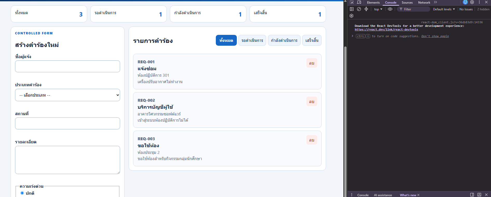 |
| TC-02 Controlled input | ทุกช่องเปลี่ยนค่าตาม State และกรอกข้อมูลได้ตามปกติ | Pass | 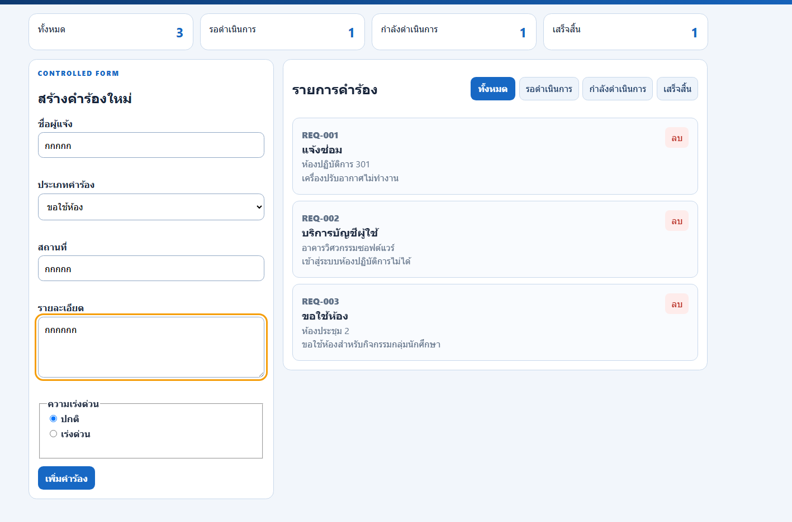 |
| TC-03 Invalid submit | ระบบไม่เพิ่มคำร้องและแสดงข้อความ Error ใกล้ช่องที่กรอกไม่ถูกต้อง | Pass |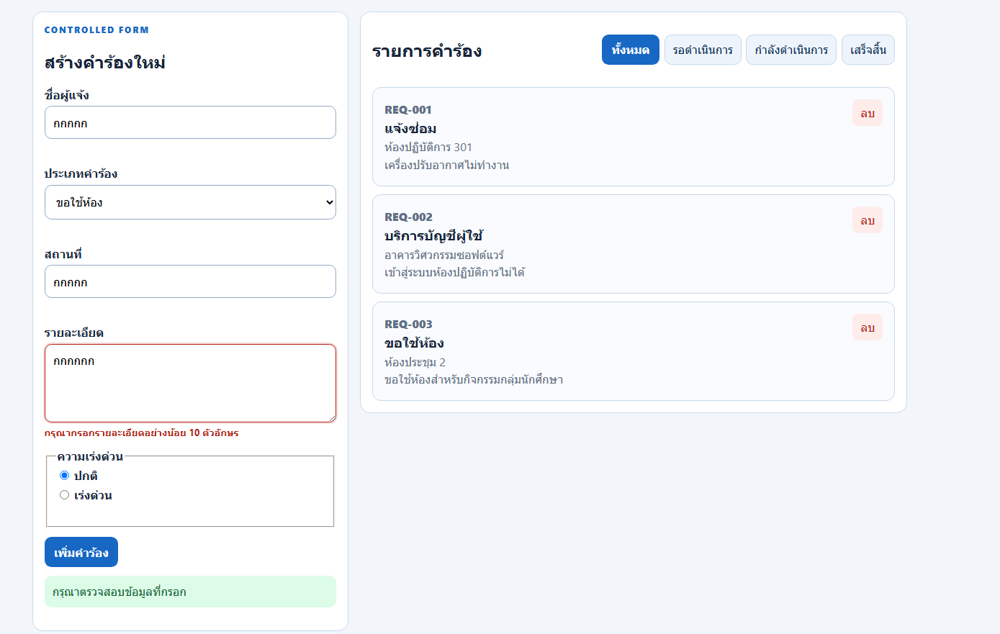 |
| TC-04 Valid submit | เพิ่มคำร้องสถานะ pending สำเร็จ Summary เพิ่ม และฟอร์ม Reset | Pass | 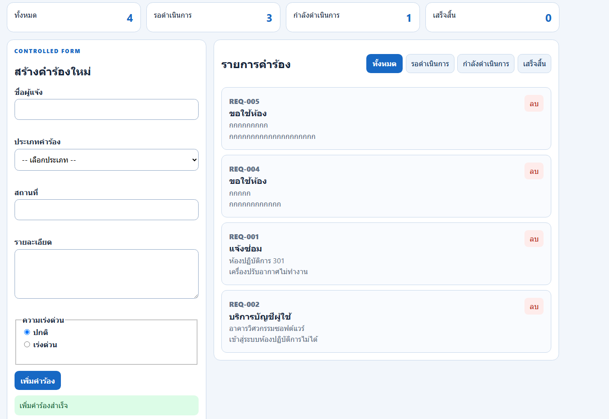 |
| TC-05 Filter status | ตัวกรองแสดงเฉพาะคำร้องที่มีสถานะตรงกับค่าที่เลือก | Pass | 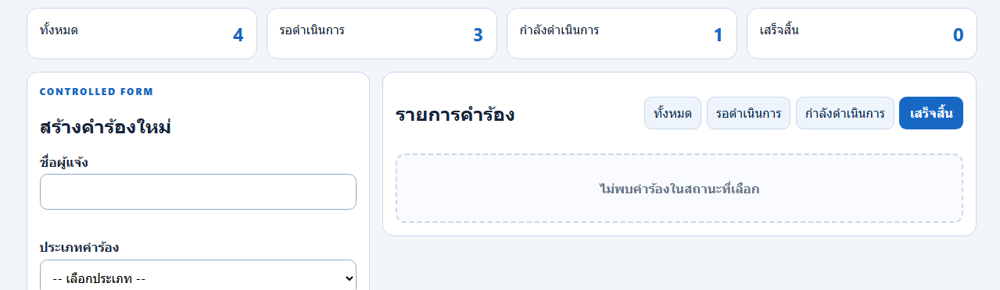 |
| TC-06 Return all | เมื่อเลือกทั้งหมด ระบบแสดงคำร้องครบทุกสถานะ | Pass | 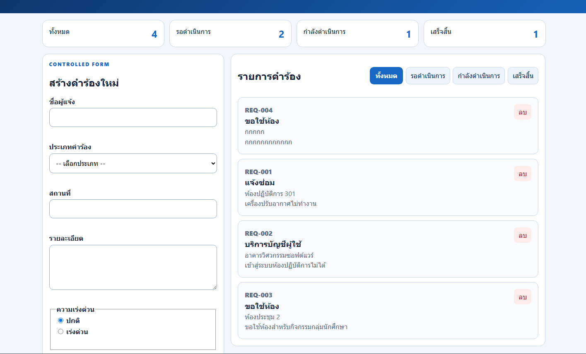 |
| TC-07 Empty state | ระบบแสดงข้อความเมื่อไม่มีคำร้องที่ตรงกับตัวกรอง | Pass | 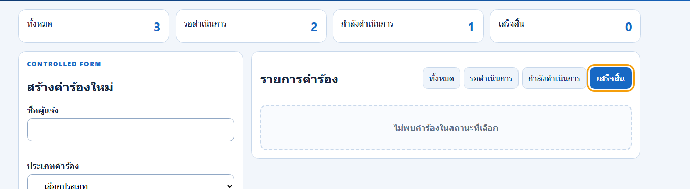 |
| TC-08 Delete | ลบคำร้องตาม ID ถูกต้อง และ Summary กับรายการเปลี่ยนตาม State | Pass | 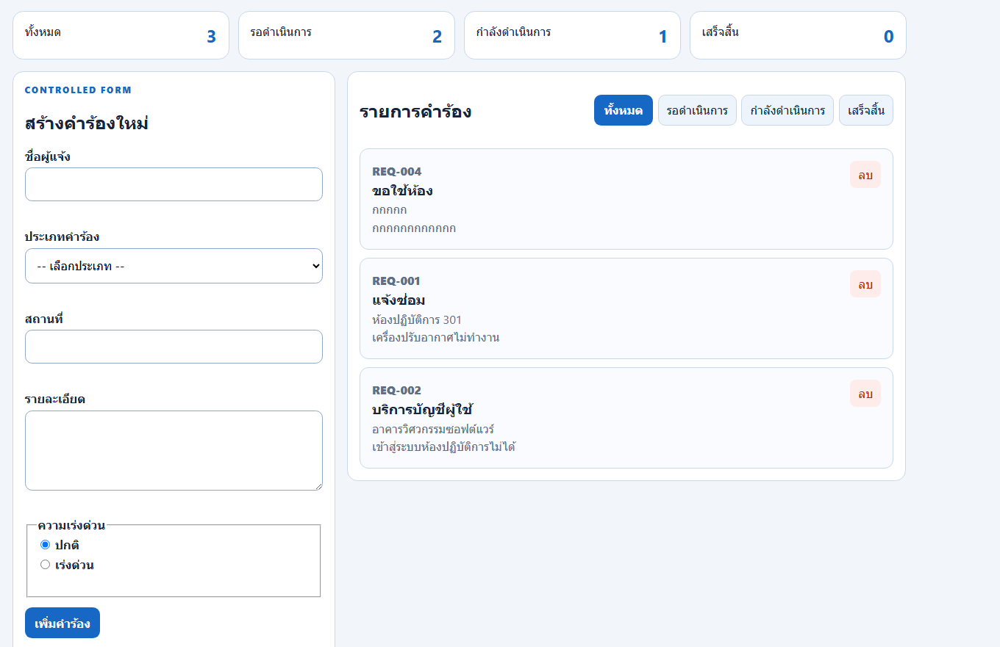 |
| TC-09 375px | หน้าเว็บแสดงได้ที่ความกว้าง 375px โดยไม่มี Horizontal Scroll | Pass | 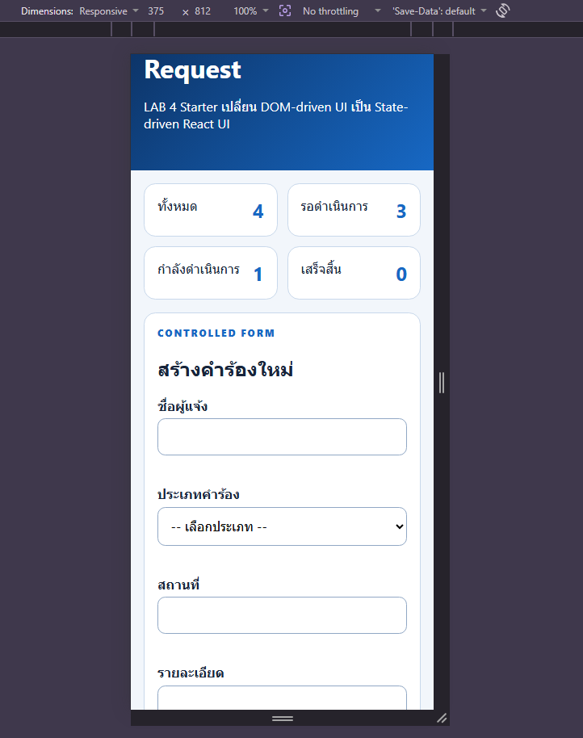 |
| TC-10 Keyboard | ใช้ Tab เข้าถึงช่องกรอก ตัวกรอง และปุ่มได้ พร้อมเห็น Focus ชัดเจน | Pass | 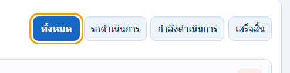 |
| TC-11 Build/preview | npm run build และ npm run preview ทำงานสำเร็จ | Pass | 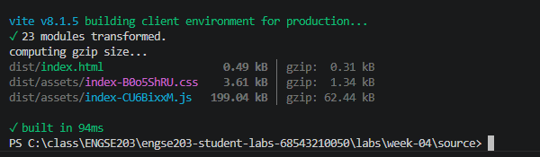 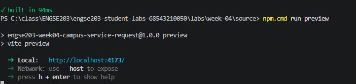 |
| TC-12 Pages | รอตรวจหลังเผยแพร่ GitHub Pages | Pending | evidence/pages-incognito.png |

## Screenshots

- Desktop: ``
- Mobile 375px: ``
- Validation/empty state: 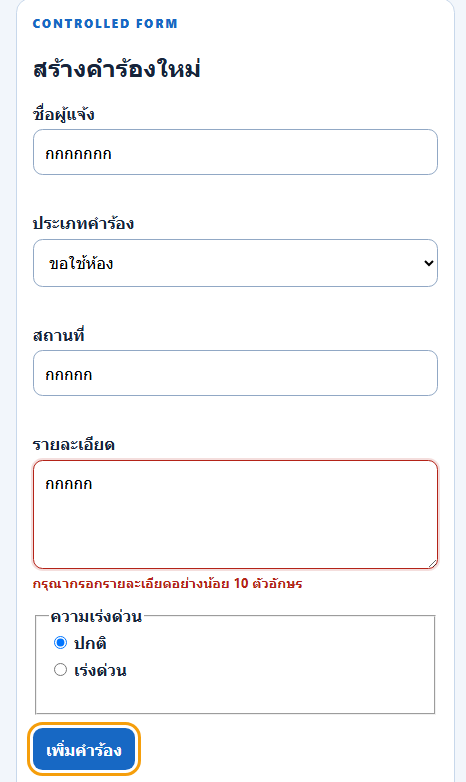 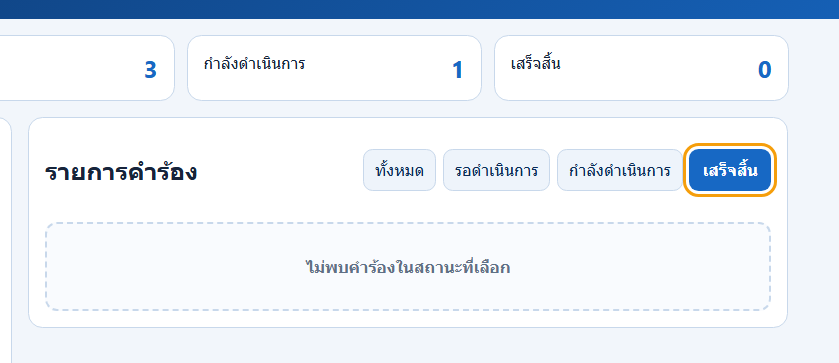

## Week 03 → Week 04 Reflection

ใน Week 03 การเปลี่ยนแปลงหน้าเว็บใช้การเข้าถึงและแก้ไข DOM โดยตรง ซึ่งทำให้ต้องจัดการ Element และข้อมูลหลายส่วนด้วยตนเอง ใน Week 04 แอปพลิเคชันใช้ React State เป็นแหล่งข้อมูลหลักของ UI เมื่อ State เปลี่ยน React จะ Render ส่วนที่เกี่ยวข้องใหม่โดยอัตโนมัติ ข้อมูลไหลจาก Parent ไปยัง Child ผ่าน Props และเหตุการณ์ไหลกลับผ่าน Callback การใช้ State-driven UI จึงช่วยให้การเพิ่ม กรอง และลบคำร้องมีโครงสร้างชัดเจนและดูแลรักษาได้ง่ายกว่าการทำ DOM mutation โดยตรง

## AI / External Resource Disclosure

ใช้ Microsoft Copilot และเอกสารโจทย์ ENGSE203 LAB 4 ใน GitHub เพื่อช่วยอธิบายข้อกำหนด วิเคราะห์ผลจาก `npm run check` และให้คำแนะนำเกี่ยวกับ React State, Props, Callback, Controlled Form, Validation, Conditional Rendering, Accessibility และ Responsive Design

